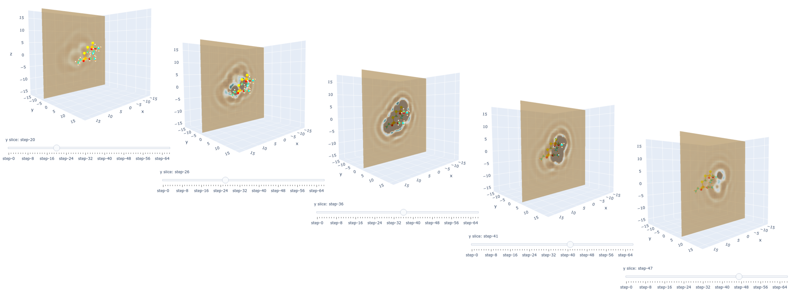

# RISM grids

Some jupyter-notebooks to visualise RISM data and align RISM grids to molecules.  Also includes classes to load and manipulate RISM data generated using AMBER.

- `RISM_grids_usage.ipynb`: Loading and manipulating RISM data using the classes in `RISM_grids.py`.
- `RISM_3D_plots.ipynb`: Examples of plotting RISM data in 3D, including interactive plots.

The `html` files contain working examples of the jupyter-notebooks, including the interactive plots in `RISM_3D_plots.ipynb`.

## Examples:
(From `RISM_3D_plots.ipynb`)

- #### Align molecule with 2D slices through 3D RISM data.
  Code will generate VMD commands to align the view of the molecule with the corresponding 2D RISM slice.

- #### Interactive plot showing the RISM distribution around a molecule.
  The slider moves the 2D surface over the molecule to show how the RISM grid reflects the 3D shape of the molecule.

